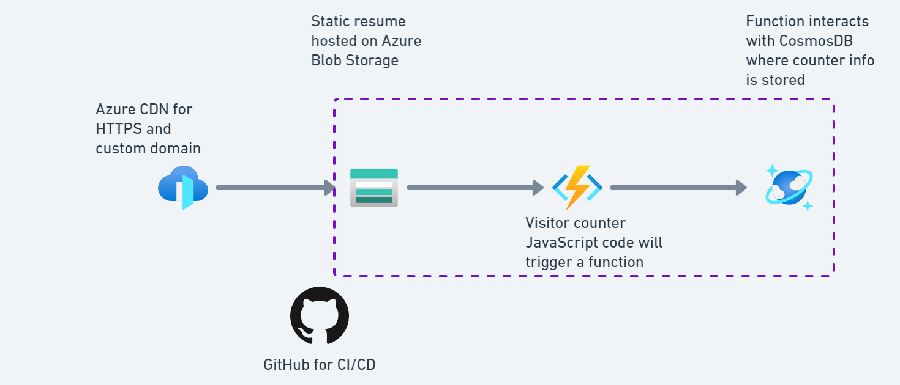
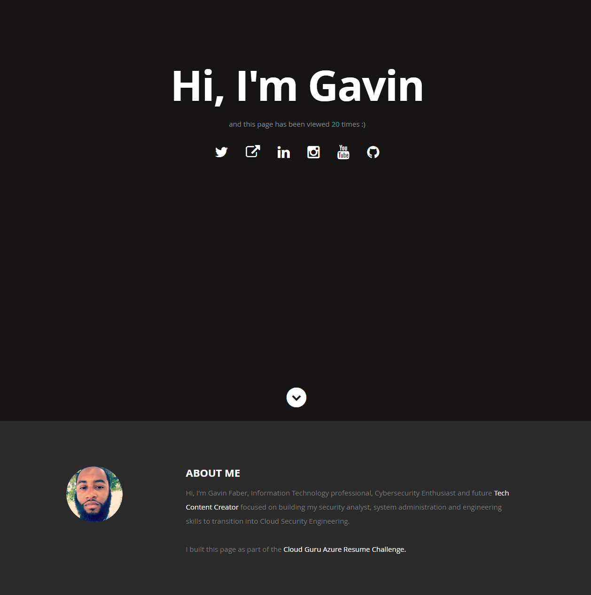

# Azure Resume Challenge

<h2>Description</h2>

My [Azure resume](https://www.gavinpaul.io/) hosted in Microsoft Azure following [ACG project video.](https://www.youtube.com/watch?v=ieYrBWmkfno&t=569s&ab_channel=ACloudGuru)

I chose to embrace this challenge to bolster my skills in Azure. Involvement in a project offers the most efficient pathway to skill enhancement. This often entails confronting obstacles or difficulties that demand a deeper exploration of the technology.

<h2>Diagram</h2>

<h2>Resources Used</h2>

- Resource Group
- Storage Account (Blob)
- Cosmos DB for NoSQL
- Azure CDN
- Azure Functions
- Application Insights

<h2>Website</h2>

